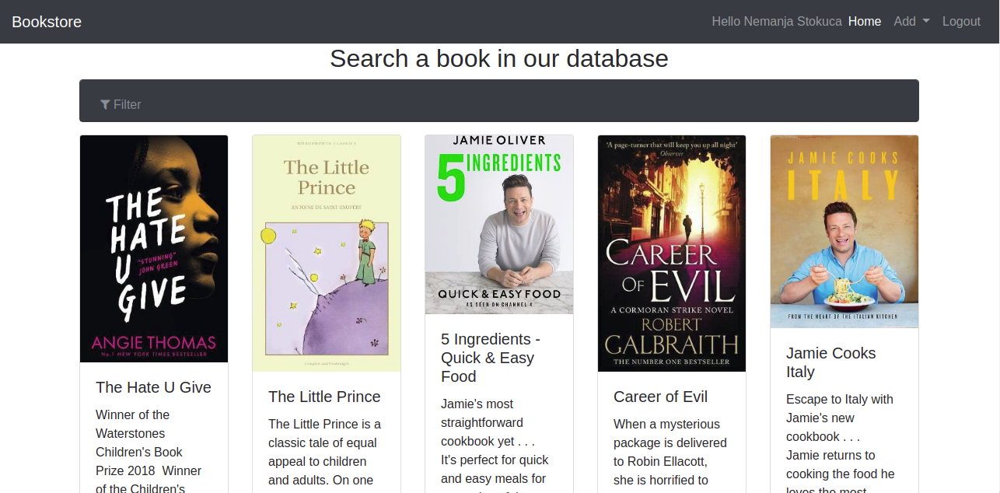

# Bookstore

Bookstore is an application which was developer by MEAN4 technology and serve for presentation of personal knowledge
App contains tree types of users
	1.First type is guest, who can search and look all books in our DB
	2.Second type is registration users, who can add book, update and delete books. Registration users can update and delete only books they have added 
	3.Third type is administration users, who have all the rights

##Instalation

*Prerequisites
NodeJS
MongoDB – make sure it’s running on the default port(27017)

1. Clone this repository: git clone https://github.com/neemanja/bookstore.git
2. Navigate to the bookstore directory: cd bookstore
3. Install the dependencies: npm install
4. Start the server app: npm start
5. Navigate to the client directory: cd bookstore/client
6. Install the dependencies: npm install
7. Start the client app: ng serve
8. Then open your browser and go to: http://localhost:4200

##App preview
Home scren

   

Home scren mobile view

   

User books

  

Add book

   

Edit book

    

Show book

     

Category book

   

Login and registration

   

